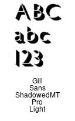
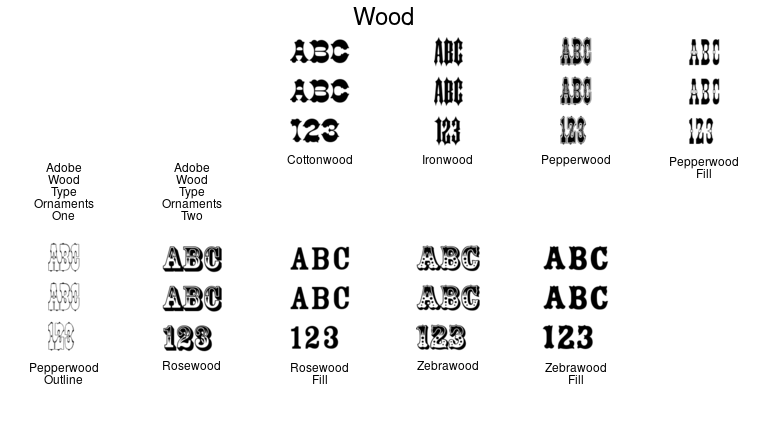

# imfonts
Create sample images of all fonts accessible to ImageMagick

# Usage:
  imfont [ __fontname__ ]

If fontname is left out, an individual image file for every font on the system will be generated.

If fontname is specified, for example `imfont Wood`, a single image is created with all matching fonts in it.

Fontname is case insensitive and can be a regular expression.
For example,  

    imfont "optima|omega"

