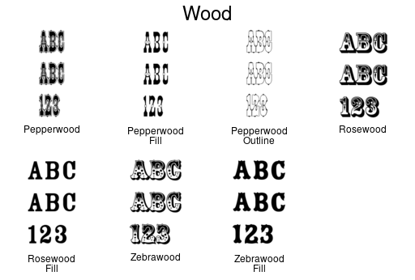

# imfonts
Create sample images of all fonts accessible to ImageMagick

## Usage:

  imfont [ _fontname_ ]

### All fonts

    imfont

When _fontname_ is omitted, sample images are created for all fonts on
the system. Each file has the same name as a font + `.png`. For
example, to the right is the file named `GillSansShadowedMTPro-Light.png`.

 

If _fontname_ is specified, for example `imfont Wood`, a single image
is created with all matching fonts in it.

_Fontname_ is case insensitive and can be a regular expression.
For example,

    imfont "optima|omega"

## List font names

If you simply want to list the fonts ImageMagick knows about, use this

    convert -list font | grep Font:
	
